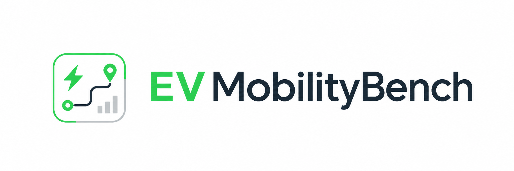

<p align="center">
  
</p>

<p align="center">
  <strong>Road-network-grounded benchmark generation for electric vehicle routing</strong><br>
  <em>Classical EVRPTW · multi-depot EVRPTW · two-echelon EVRP · OSM urban graphs · structured export</em>
</p>

<p align="center">
  <a href="https://github.com/ayoub-hanif-evrp/EVMobilityBench_Framework">https://github.com/ayoub-hanif-evrp/EVMobilityBench_Framework</a>
</p>

---

## Overview

**EVMobilityBench** generates **Electric Vehicle Routing Problem (EVRP)** benchmark instances on **road-network-grounded** urban graphs from OpenStreetMap. It is a **benchmark generator**, not an optimisation solver.

Many EVRP benchmarks still rely on artificial coordinates or Euclidean distances. EVMobilityBench instead:

- builds a **directed road graph** (OSMnx → largest strongly connected component)
- **snaps** depots, customers, stations, and satellites to reachable road nodes
- computes **shortest-path** distance, travel time, and energy on the graph
- supports **three EVRP families** in one codebase
- exports structured **JSON/CSV** for solvers and analysis

**Road vs geometric baselines:**

- **Distance matrix:** shortest paths weighted by **road-segment length** (length-shortest paths).
- **Travel-time matrices:** shortest paths weighted by **period-specific travel time** (time-shortest paths).
- **Energy matrix:** segment-level energy **accumulated along the minimum-travel-time directed path**.
- Geometric baselines are coordinate-based references used for representation ratios — not observed traffic or fleet telemetry.

**Time windows:** supported tightness settings are **wide**, **medium**, and **tight**.

**Validation / diagnostics** check structural validity, time-window screening, and optional energy screening. They **do not prove** the existence of a complete feasible EVRP route.

---

## Install

```bash
pip install -e .
pip install -e ".[notebook]"    # Jupyter + Folium + matplotlib
pip install -e ".[analysis]"    # scipy / matplotlib for analysis scripts
```

| Name | Value |
|------|--------|
| pip package | `evrp-benchmark` |
| import | `evrp_instance_generator_framework` |
| Repository | https://github.com/ayoub-hanif-evrp/EVMobilityBench_Framework |
| Zenodo DOI | [10.5281/zenodo.22753968](https://doi.org/10.5281/zenodo.22753968) |

---

## Quick start

```python
from evrp_instance_generator_framework import EVFeatures, GenerationConfig, generate_instance
from evrp_instance_generator_framework.export.instance_export import export_instance

config = GenerationConfig(
    variant="classic_evrptw",   # or multi_depot_evrptw, two_echelon_evrp
    city="Casablanca",
    country="Morocco",
    depot_lat=33.5731,
    depot_lon=-7.5898,
    seed=42,
    num_customers=50,
    num_stations=10,
    customer_pattern="rc",      # c clustered, r dispersed, rc mixed
    time_window_tightness="medium",  # wide | medium | tight
)

instance = generate_instance(config, ev_features=EVFeatures(), compute_matrices=False)
export_instance(instance, output_dir="out", fmt="json")
```

Required fields: `city`, `country`, `depot_lat`, `depot_lon`. See `src/evrp_instance_generator_framework/types.py` for defaults.

**Multi-depot / two-echelon:** set `variant` and `num_additional_depots` or `num_satellites`, or call `generate_multi_depot_evrptw` / `generate_two_echelon_evrp`.

---

## Web wizard (NiceGUI)

```bash
python web/NiceGUI_app/main.py
```

Open http://127.0.0.1:8080 (override with `PORT`). Marker icons live in `web/NiceGUI_app/assets/`.

---

## Variants and generation (summary)

| `variant` | Structure |
|-----------|-----------|
| `classic_evrptw` | One depot, customers, chargers, time windows |
| `multi_depot_evrptw` | Extra depots (`num_additional_depots`) |
| `two_echelon_evrp` | Depot + satellites (`num_satellites`) |

**Customers:** OSM buildings (shops fallback) → snap → pattern selection → demand / service / parking / time windows linked to depot travel time.

**Stations (after customers):** observed EV (k-medoids) → proxy hosts → synthetic coverage fill. Each record carries provenance (`observed_ev`, `proxy_host`, `synthetic`). Proxy and synthetic sites are **not** labelled as real chargers.

**Pipeline:** OSM graph → SCC → elevation / edge times → facilities → customers → stations → service graph / optional matrices → instance validation & diagnostics → `BenchmarkInstance`.

Classic phased API: `generate_customers_phase` → `generate_stations_phase` → `finalize_benchmark_instance`.

---

## Project layout

```text
.
├── README.md                 # this file (sole project documentation)
├── LICENSE
├── CITATION.cff
├── pyproject.toml
├── logo_evrp.png
├── src/evrp_instance_generator_framework/   # core library
├── notebooks/                # variant user-guide notebooks
├── web/NiceGUI_app/          # interactive wizard
└── analysis/
    ├── config/               # campaign, cities, depots
    ├── scripts/              # analysis helpers from released CSVs
    └── results/
        └── data/             # released instance-level CSVs
```

---

## Representation analysis

Road-versus-geometric **representation** study (four cities; n = 160 structural instances).

**Evaluation campaign** (`analysis/config/campaign.json` profile `paper`):

| Setting | Value |
|---------|--------|
| Cities | Casablanca, Madrid, Paris, Shenzhen |
| Customers / stations | 80 / 20 |
| Classical pattern seeds | 10001–10010 |
| Multi-depot / two-echelon cross-family seeds | 10001–10005 |
| Customer patterns | `c` clustered, `r` dispersed, `rc` mixed |
| Time-window tightness | medium |
| Energy period | off_peak |
| Bootstrap resamples | 10,000 (seed 20260824) |

| Asset | Location |
|-------|----------|
| Instance-level metrics | `analysis/results/data/*.csv` |
| Campaign config | `analysis/config/campaign.json` |
| Generation-time summary | `python analysis/scripts/report_generation_times.py` |

**Bootstrap:** instance-level 95% CIs use **10,000** resamples (seed `20260824`), matching `analysis/config/campaign.json`.

**Key headline numbers** (instance-level medians; 95% bootstrap CI):

- Distance ratio overall **1.226** (1.217–1.236)
- Charging mismatch **15.0%** (13.7–16.2%); conditional detour **0.741 km**
- Travel-time ratio **1.239**; energy ratio **1.250**
- Classic matched NND Friedman: χ² = 80, Kendall W = 1.000 (40 triples)

The included evaluation concerns benchmark representation; routing-solver performance comparisons are outside the scope of this release.

**Generation times:** mean warm-cache generation times from a separate performance campaign are stored in `analysis/results/data/generation_time_by_design.csv`. Summarize them with `python analysis/scripts/report_generation_times.py`.

---

## Export

```python
export_instance(instance, output_dir="benchmark_export", fmt="json")  # or "csv"
```

Files include metadata, road network nodes/edges, customers, stations, service nodes, and (when relevant) depots or satellites. Matrices are stored on the instance when `compute_matrices=True` (save yourself if needed).

Maps: `plot_benchmark_on_map` / `map_benchmark_interactive` in `visualization.py`.

---

## Reproducibility notes

- `GenerationConfig.seed` controls selection and attribute randomness.
- OSM cache defaults to `cache/` (gitignored). Override with `EVRP_BENCHMARK_CACHE_DIR` or `osm_cache_dir`.
- OSM data changes over time — keep cached graphs with config and seed for long-term reproduction.
- Analysis results under `analysis/results/data/` are the released numerical archive.
- Instance validation & diagnostics do **not** certify a complete feasible tour.

---

## Citation

See [`CITATION.cff`](CITATION.cff). Software title:

**EVMobilityBench: Road-Network-Grounded Benchmark Generation and Evaluation for Electric Vehicle Routing**

Repository: https://github.com/ayoub-hanif-evrp/EVMobilityBench_Framework  
Zenodo DOI: [10.5281/zenodo.22753968](https://doi.org/10.5281/zenodo.22753968)

## License

MIT — see [LICENSE](LICENSE).
